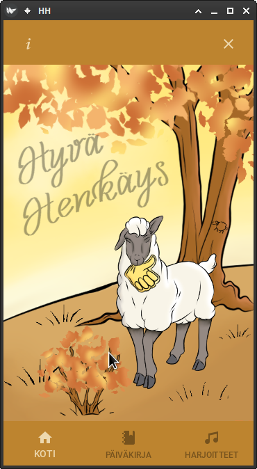
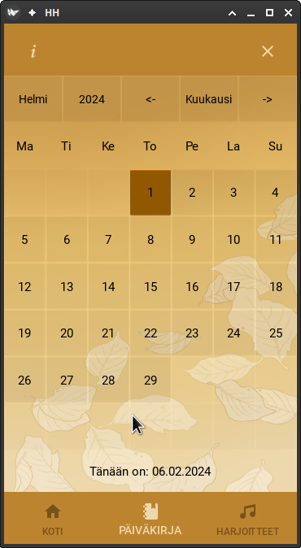
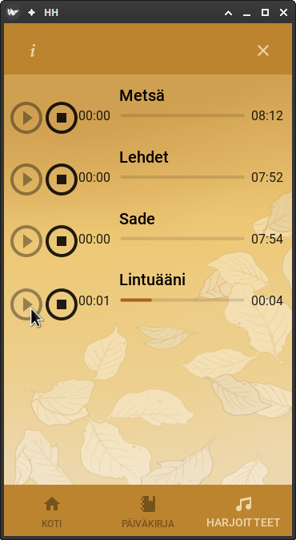

Hyvä Henkäys
===========

Credits
-------
* Arts  &copy; Taru Haapala
* Music &copy; Jani Vähämäki
* Code  &copy; Taru Haapala &amp; Jukka Valvanne
* Database &copy; Jukka Valvanne
* Documentation &copy; Taru Haapala &amp; Jukka Valvanne
* datepicker.kv &copy; el3 &amp; Jukka Valvanne, MIT.

Mitä?
-----
Tehdään rauhoittumissovellus puhelimelle.

# Ohjelma sisältää:
* Vastuunvapautuslause: tämä ei ole virallista terapiaa eikä ohjelmaa ei tule käyttää mielenterveyspaveluiden korvikkeena. Konsultoi hoitokontaktiasi ennen ohjelman käyttöä.
* Rauhoittavia ääninäytteitä.
* Pitää kirjaa käyttäjän edistymisestä kalenterilla.
* Rauhoittava väriteema
* Saavutettava myös värisokealle

Kehittäminen
-------
kehitys käydään kunkin omassa branchissa ja koodimuutokset mergetään Jukan haarassa testattavaksi. Jos muutokset todetaan kehitysympäristössä toimivaksi ja ne katsotaan sopivaksi edistysaskeleeksi, tehdään tästä apk-paketti testattavaksi ja viedään versio dev-x.x.x -haaraan talteen. Näyttötyöversio viedään main-haaraan. jatkokehitys käydään yllä kuvatulla periaatteella.

Asennus
-------
* Koodista ei ole virallisessa levityksessä valmista apk-pakettia; voit rakentaa paketin buildozer-ohjelmalla puhelimellesi.
* Voit windows- tai linux-käyttöjärjestelmällä kuitenkin ajaa ohjelman seuraavasti: 
* 1. kloonata tai ladata tämän haaran koneellesi zip:inä
* 2. asentaa python 3, kivy 2.2 sekä kivymd 1.1-kirjastot vaatimuksineen (pip install -r requirements.txt) koneellesi.
* 3. käynnistä ohjelma python main.py -käskyllä.
